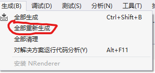

服务于本科教学的三维渲染系统
---

# 环境配置

+ 操作系统: `Windows 10`
+ 编译器: `MSVC(Visual Studio 2019)`
+ `Opengl 3.3` 以上
+ `CMake 3.18`以上

# 编译说明

1. 打开`./code`所在文件夹->右键->使用`Visual Studio`打开
2. 项目->生成CMake缓存

    
3. 生成->全部重新生成

    
4. 选择启动项

    

*注: 不喜欢用CMake的同学可以通过CMake生成vs工程使用*

# 如何写我自己的渲染算法(重要)
本项目使用了一个简单的插件注册系统
1. 打开`./code/components`文件夹
2. 复制`RenderExample`文件夹, 并将其修改成你自己喜欢的名字
3. 修改复制后的文件夹里的`CMakeLists.txt`文件
    ```CMake
    ...
    # 将"RenderExample"修改为你自己喜欢的名字, 千万不要和别的文件夹里的名字重复
    set(MY_COMPONENT_NAME "RenderExample")
    ...
    ```
4. 修改`./code/components/CMakeLists.txt`
    ```CMake
    
    ...
    # 添加
    add_subdirectory("./我的文件夹")
    ```
5. 继承类`NRenderer::RenderComponent`, 并且重写`void render(...)`函数
    ```C++
    // 详情请看RenderExample示例
    class Adapter : public NRenderer::RenderComponent {
        virtual void render(NRenderer::SharedScene spScene) {
            ....
        }   
    };
    ```
6. 注册插件
    ```C++
    + 参数1 -> 插件名称，不要写中文
    + 参数2 -> 插件的描述
    + 参数3 -> 注册的类, 类的名字
    REGISTER_RENDERER(Render, RenderTest, A);
    ```
7. 重新生成CMake缓存并且重新编译插件

# 使用方法

##  导入场景文件


##  修改材质信息


## 修改场景参数


## 选择渲染方法并渲染


## 切换渲染结果/快速预览


# 样例算法(持续添加...)

## Ray Cast
向场景中投射光线, 计算直接光照. 计算方法为(Phong, 忽略了环境光)
$$
L_o = k_d\cdot Li + k_s\cdot Li(V \cdot R)^p
$$

场景文件为 `ray_cast_cornel.scn`

渲染结果:


## Simple Path Tracer
使用Monte Carlo方法计算光照, 不支持网格, 仅支持漫反射材质

场景文件`path_tracing_cornel.scn`

渲染结果(采样数2048)


## Path Tracing 导体材质(代码未提供，需要自己实现)
导体材质，即金属，具有镜面反射效果。

$$
f_{BRDF}(x, w_i, w_o) = F_r(w_r)\frac{\delta(w_i-w_r)}{cos \theta_i} \\
$$
$\delta(x)满足:$
$$
\delta(x) = 
    \begin{equation}
    \left\{
                \begin{array}{lr}
                \infin & x = 0 \\
                0 & x \neq0 \\
                \end{array}
\right.
    \int \delta(x)dx = 1
    \end{equation}
$$
其中,
  - $w_r$为反射光线
  - $F_r(w_r)$为菲涅尔项


## Path Tracing 绝缘体材质(代码未提供，需要自己实现)
绝缘体，例如玻璃


## Path Tracing 实现Enviroment Map 光源


# 其他

[代码说明(intro.md)](./doc/intro.md)